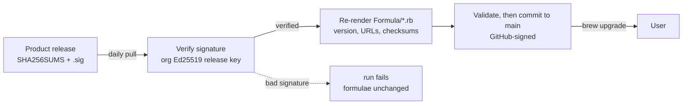

# Glyndor Homebrew tap

Homebrew formulae for Glyndor's macOS binaries. The macOS counterpart to the
signed apt repository at [apt.glyndor.net](https://apt.glyndor.net) (Linux).

[](https://github.com/Glyndor/homebrew-tap/actions/workflows/update.yml)

## Install

```bash
brew install glyndor/tap/podup
```

`brew` reads this repository directly from GitHub, so there is no separate
server or domain to trust. Each formula pins the exact SHA-256 of the release
binary it installs, so Homebrew refuses a download whose bytes don't match.

Upgrades come with `brew upgrade` once a new release is published (see below).

## Available formulae

| Formula | Product |
|---|---|
| `podup` | docker-compose translator and runner for rootless Podman |

## How it stays current



Nothing is pushed into this repository from a product. A workflow here
(`.github/workflows/update.yml`) runs daily and on demand, mirroring the apt
repository's pull model:

1. Read each product's latest GitHub release.
2. Download its `SHA256SUMS` and `SHA256SUMS.sig` and **verify the signature
   against the org's Ed25519 release key**, the same key the products embed.
3. Re-render `Formula/*.rb` with the verified version, URLs and checksums.
4. Validate the re-rendered formulae, then commit them straight to `main`,
   signed by GitHub.

So the checksum a formula ships is one taken from a signature-verified manifest,
not from whatever an unverified release asset happened to contain, and no
product needs a write credential on this repository.

The commit is direct rather than a pull request because the organisation forbids
GitHub Actions from opening PRs, and because a tap's git content *is* the
published artifact, unlike the apt repository whose automation publishes to R2
and never writes git. Validation therefore runs in the same job *before* the
commit lands, since no review stands between it and `brew install`.

`Formula/*.rb` is generated by `scripts/render-formulae.sh`; edit the generator,
never the formulae by hand.
