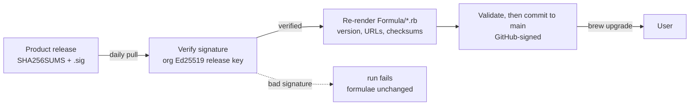

<div align="center">

# Glyndor Homebrew tap

**Homebrew formulae for Glyndor's signed binaries.**
The Homebrew counterpart to the signed apt repository at
[apt.glyndor.net](https://apt.glyndor.net).

[](https://github.com/Glyndor/homebrew-tap/actions/workflows/audit.yml)
[](https://github.com/Glyndor/homebrew-tap/actions/workflows/update.yml)

</div>

## Install

```bash
brew install glyndor/tap/podup
```

Upgrades arrive with `brew upgrade`, like any other formula.

| Package | What it is | macOS | Linux |
| --- | --- | --- | --- |
| [`podup`](https://github.com/Glyndor/podup) | Docker-compose translator and runner for rootless Podman | this tap | this tap |
| [`epistle`](https://github.com/Glyndor/epistle) | Self-hosted headless mail server: SMTP, IMAP | not built | not built |
| [`helmly-agent`](https://github.com/Glyndor/helmly-agent) | Hardened server agent for the Glyndor panel: signed commands over WireGuard and mTLS | not built | not built |

On Linux this tap serves the same signed binaries the products publish for
`x86_64` and `arm64`. They are glibc builds, so musl distributions such as
Alpine are not covered by them.

## What you are trusting

**The checksum in each formula does not come from the release asset.** It
comes from a `SHA256SUMS` this repository verified against the organisation's
Ed25519 release key first, the same key the products embed.

`brew` reads this repository straight from GitHub, so there is no separate
server in the path, and a download whose bytes do not match the pinned SHA-256
is refused.


```mermaid
flowchart LR
  R["Product release<br/>SHA256SUMS + .sig"] -->|daily pull| V["Verify signature<br/>org Ed25519 release key"]
  V -->|verified| G["Re-render Formula/*.rb<br/>version, URLs, checksums"]
  G --> C["Validate, then commit to main<br/>GitHub-signed"]
  C -->|brew upgrade| U["User"]
  V -.->|bad signature| X["run fails<br/>formulae unchanged"]
```

Nothing is pushed here from a product, and no product holds a write
credential on this repository. A bad signature fails the run and leaves the
formulae untouched, so the failure mode is a tap that stops updating, never
one that ships an unverified binary.

---

See [CONTRIBUTING.md](CONTRIBUTING.md). Report a problem via the
[Security](https://github.com/Glyndor/homebrew-tap/security) tab.
[MIT](LICENSE).
