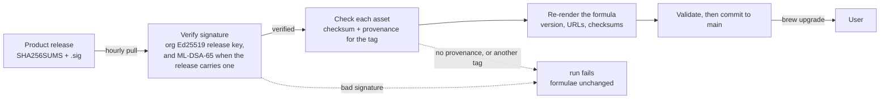

# Glyndor Homebrew tap

Homebrew formulae for Glyndor software on macOS and Linux, for `x86_64` and `arm64`.

[](https://github.com/Glyndor/homebrew-tap/actions/workflows/audit.yml)
[](https://github.com/Glyndor/homebrew-tap/actions/workflows/update.yml)

## Install

```bash
brew install glyndor/tap/podup
```

podup needs Podman 6.2.0 or newer, reached through a local socket, and does not
support Podman 5. On macOS that means a running `podman machine`; on Linux it
means a Podman installed separately. [podup's platform
notes](https://github.com/Glyndor/podup/blob/main/docs/docker-migration.md#platforms)
explain both. Then follow podup's [quick start](https://github.com/Glyndor/podup#quick-start).

## What is served

| Package | What it is | Platforms |
| --- | --- | --- |
| [`podup`](https://github.com/Glyndor/podup) | Run Compose projects on rootless Podman. | macOS and Linux, `x86_64` and `arm64` |

podup is also available from the [Glyndor apt repository](https://github.com/Glyndor/apt)
for Debian and Ubuntu and from the [Scoop bucket](https://github.com/Glyndor/scoop-bucket)
for Windows.

## Updates

`brew upgrade` brings new releases. The tap checks for a new release every hour,
which GitHub often runs late, so a release is usually served within a few hours.

## What you are trusting

The checksum in each formula does not come from the release asset. It comes
from a `SHA256SUMS` this repository verified against the organisation's Ed25519
release key first, the same key the products embed. Each asset is also
downloaded and its SHA-256 compared with that manifest, and it must carry build
provenance for the release tag from the product's release workflow, so an old
binary re-published under a new tag is refused even when its signature is valid.

`brew` reads this repository straight from GitHub, so there is no separate
server in the path, and a download whose bytes do not match the pinned SHA-256
is refused. To check a version by hand, compare the `sha256` values in
`Formula/podup.rb` with the `SHA256SUMS` file attached to the matching podup
release.

A second, post-quantum release signature (ML-DSA-65) is supported beside the
Ed25519 one and never replaces it; no ML-DSA-65 key is configured yet, so every
release is admitted on its Ed25519 signature.


```mermaid
flowchart LR
  R["Product release<br/>SHA256SUMS + .sig"] -->|hourly pull| V["Verify signature<br/>org Ed25519 release key,<br/>and ML-DSA-65 when the release carries one"]
  V -->|verified| P["Check each asset<br/>checksum + provenance for the tag"]
  P --> G["Re-render the formula<br/>version, URLs, checksums"]
  G --> C["Validate, then commit to main"]
  C -->|brew upgrade| U["User"]
  V -.->|bad signature| X["run fails<br/>formulae unchanged"]
  P -.->|no provenance, or another tag| X
```

Nothing is pushed here from a product: the tap pulls. A bad signature fails the
run and leaves the formulae untouched, so the failure mode is a tap that stops
updating, never one that ships an unverified binary.

The [threat model](docs/threat-model.md) says what this tap protects, against
whom, and which test holds each control in place.

---

See [CONTRIBUTING.md](CONTRIBUTING.md). Report a problem via the
[Security](https://github.com/Glyndor/homebrew-tap/security) tab.

[MIT](LICENSE).
